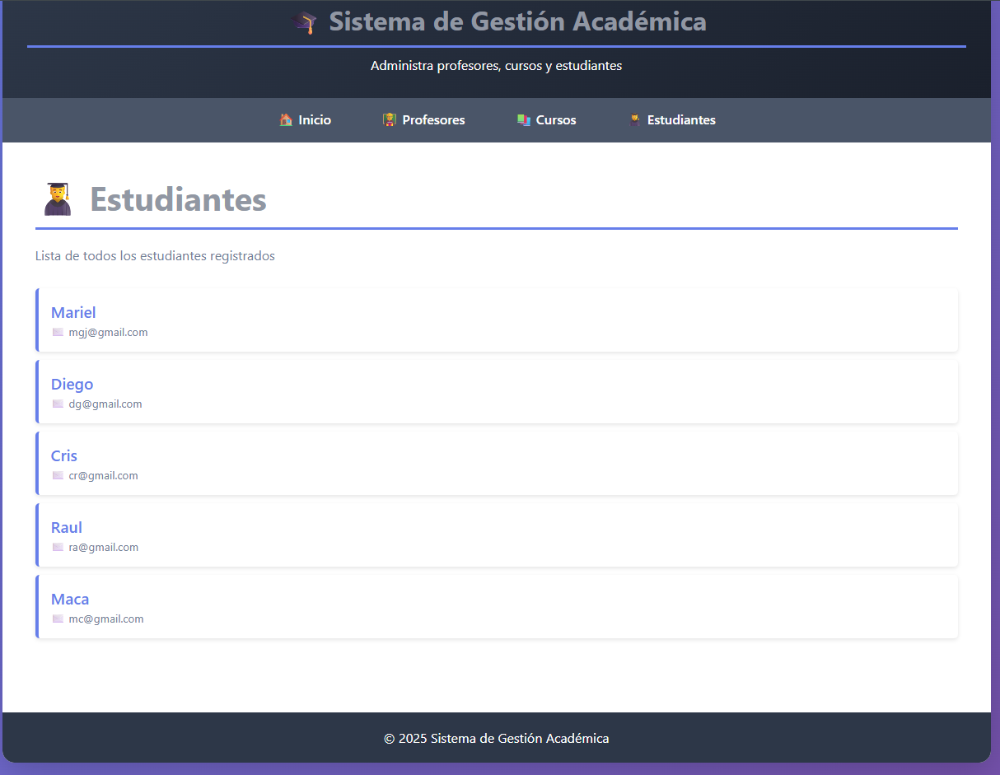

# Sistema de Gestión Académica 🎓





Sistema web desarrollado en Django para administrar profesores, cursos y estudiantes de una institución educativa.

## Características

- ✅ Gestión de Profesores
- ✅ Gestión de Cursos
- ✅ Gestión de Estudiantes
- ✅ Sistema de Inscripciones
- ✅ Seguimiento de Notas
- ✅ Perfiles de Estudiantes
- ✅ Interfaz moderna y responsive

## Tecnologías

- Python 3.x
- Django 5.2
- SQLite
- HTML/CSS

## Instalación

1. Clonar el repositorio
```bash
git clone <url-del-repositorio>
cd gestion_academica
```

2. Crear y activar entorno virtual
```bash
python -m venv .venv
.venv\Scripts\activate  # Windows
```

3. Instalar dependencias
```bash
pip install django
```

4. Ejecutar migraciones
```bash
python manage.py makemigrations
python manage.py migrate
```

5. Crear superusuario
```bash
python manage.py createsuperuser
```

6. Iniciar servidor
```bash
python manage.py runserver
```

7. Acceder a la aplicación en: `http://localhost:8000`

## Capturas de Pantalla


## Estructura del Proyecto

```
gestion_academica/
├── academico/          # App principal
│   ├── models.py       # Modelos de datos
│   ├── views.py        # Vistas
│   ├── urls.py         # URLs
│   └── templates/      # Templates HTML
├── gestion_academica/  # Configuración del proyecto
├── manage.py
└── db.sqlite3
```

## Modelos

- **Profesor**: Gestión de profesores
- **Curso**: Cursos ofrecidos
- **Estudiante**: Estudiantes registrados
- **Inscripcion**: Relación estudiante-curso
- **Perfil**: Información adicional de estudiantes

## Autor

Talento Digital - Módulo 7

## Licencia

Este proyecto fue desarrollado con fines educativos.
